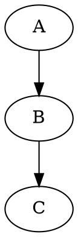
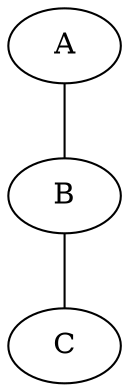

# mdpreview

## TL;DR

* Single-file bash script that converts Markdown to styled HTML and opens it in your browser
* Renders Mermaid, D2, and Graphviz diagrams out of the box
* Side-by-side diff mode with red/green highlighting for comparing two markdown files
* Ships with 4 built-in styles: gdocs, github, dark, academic
* Supports custom CSS styles via `~/.mdpreview/` with `@import` for composability
* Watch mode auto-regenerates and reloads the browser tab on file save

## Purpose

Pandoc converts Markdown to HTML but the default output looks like unstyled 1996 HTML. You end up copy-pasting CSS boilerplate or fighting with templates every time. And if your Markdown has Mermaid diagrams, pandoc just renders them as code blocks. mdpreview wraps pandoc with opinionated, good-looking styles, automatic Mermaid rendering, and the open-in-browser workflow so you can focus on writing.

## Installation

mdpreview is a single file with one required dependency: [pandoc](https://pandoc.org/installing.html).

Optional dependencies for diagram rendering:

* [d2](https://d2lang.com/tour/install) for D2 diagrams (`brew install d2`)
* [Graphviz](https://graphviz.org/download/) for Graphviz diagrams (`brew install graphviz`)
* Mermaid diagrams require no local install (rendered via CDN)

```bash
# Copy the script somewhere on your PATH
cp mdpreview /usr/local/bin/
chmod +x /usr/local/bin/mdpreview
```

Optional: install `fswatch` (macOS) or `inotify-tools` (Linux) for efficient file watching. Without these, watch mode falls back to polling every 2 seconds.

## Usage

```
mdpreview [-w|--watch] [--style <name|path>] [--list-styles] <file.md>
mdpreview --diff [-w|--watch] [--style <name|path>] <file1.md> <file2.md>
```

Basic usage converts the file to HTML and opens it in your default browser:

```bash
mdpreview document.md
```

Watch mode re-renders on every save and reloads the browser tab automatically (macOS only, via AppleScript to Chrome or Safari):

```bash
mdpreview -w document.md
```

## Styles

mdpreview resolves which style to use in this order:

1. `--style` flag (highest priority)
2. `MDPREVIEW_STYLE` environment variable
3. `~/.mdpreview/default.css` file (can be a symlink)
4. Built-in `gdocs` (fallback)

### Built-in styles

| Name       | Description                                                              |
|------------|--------------------------------------------------------------------------|
| `gdocs`    | Google Docs look. Arial, 11pt, 816px max-width, 72px padding.           |
| `github`   | GitHub Markdown rendering. System font stack, 980px width, rounded code blocks. |
| `dark`     | GitHub dark theme. #0d1117 background, light text, blue links.          |
| `academic` | LaTeX-inspired. Georgia serif, justified text, centered h1, narrow width. |

Select a style by name. Just the name, no path or `.css` extension needed:

```bash
mdpreview --style github document.md
mdpreview --style=dark document.md
```

Or set a persistent default via environment variable:

```bash
export MDPREVIEW_STYLE=academic
```

List all available styles (built-in and user-installed):

```bash
mdpreview --list-styles
```

### Custom styles

Create `~/.mdpreview/` and drop CSS files in it. Style files are raw CSS (no `<style>` tags). The filename minus `.css` becomes the style name, and you reference it the same way as a built-in: just `--style narrow`, not `--style ~/.mdpreview/narrow.css`.

```bash
mkdir -p ~/.mdpreview
cat > ~/.mdpreview/narrow.css << 'EOF'
body { font-family: Helvetica, sans-serif; max-width: 600px; margin: 0 auto; padding: 40px; }
h1 { font-size: 1.6em; }
EOF

mdpreview --style narrow document.md
```

To set a default style, create or symlink `~/.mdpreview/default.css`:

```bash
ln -s ~/.mdpreview/narrow.css ~/.mdpreview/default.css
```

You can also pass an absolute or relative path directly:

```bash
mdpreview --style ./project-theme.css document.md
```

### Composing styles with @import

Custom styles can import other styles (both user and built-in) using `@import`. mdpreview resolves these at build time by inlining the imported CSS, which is necessary because CSS `@import` doesn't work with `file://` URLs.

```css
/* ~/.mdpreview/TimesGithub.css */
@import "github.css";
body { font-family: "Times New Roman", Times, serif; }
```

Imports resolve against `~/.mdpreview/` first, then fall back to built-in style names. Circular imports are detected and handled (each file is included at most once).

## Diff mode

Diff mode shows two markdown files side by side with changes highlighted. Removals appear in red on the left, additions in green on the right. Modified lines are paired on the same row so you can see exactly what changed. Lines that exist only in one file get a blank on the opposite side.

```bash
mdpreview --diff old.md new.md
mdpreview --diff --style dark old.md new.md
```

Watch mode works with diff too, monitoring both files and regenerating when either changes:

```bash
mdpreview --diff -w old.md new.md
```

The diff colors adapt automatically to the active style. Dark styles get darker red/green highlights that are readable against the dark background.

## Diagrams

### Mermaid

Fenced code blocks with the `mermaid` language tag are rendered as diagrams via [Mermaid.js](https://mermaid.js.org/) (loaded from CDN). This works automatically with all styles. ELK layout is loaded for improved graph rendering.

### D2

Fenced code blocks with the `d2` language tag are compiled to SVG using the [D2](https://d2lang.com/) CLI tool. D2 blocks are processed before pandoc runs, so the resulting SVGs are referenced in the HTML output. If `d2` is not installed, blocks render as plain code with a warning.

You can specify a layout engine after the language tag:

````markdown
```d2:elk
x -> y -> z
```
````

### Graphviz

Fenced code blocks with the `graphviz` language tag are compiled to SVG using Graphviz's `dot` command. Like D2, blocks are processed before pandoc runs. If Graphviz is not installed, blocks render as plain code with a warning.

You can specify a layout engine after the language tag. The default is `dot`.

````markdown



````

Available engines: `dot`, `neato`, `fdp`, `sfdp`, `twopi`, `circo`.

All three diagram types (Mermaid, D2, Graphviz) can coexist in the same file.

## How it works

mdpreview runs pandoc to convert GitHub-Flavored Markdown to a standalone HTML5 file in `/tmp/`, replaces pandoc's default stylesheet with the resolved style CSS, appends the Mermaid script, and opens the result. In watch mode, it monitors the source file for changes using `fswatch`, `inotifywait`, or stat-based polling, then regenerates the HTML and reloads the browser tab via AppleScript.

## Testing

```bash
bash test/run_tests.sh
```

The test suite covers style resolution, all built-in styles, name resolution, `@import` with cycle detection, `--list-styles`, diff mode, D2 diagrams, Graphviz diagrams, HTML output correctness, and error cases. Tests use stub commands for pandoc, d2, dot, and browser openers so they run without side effects.
